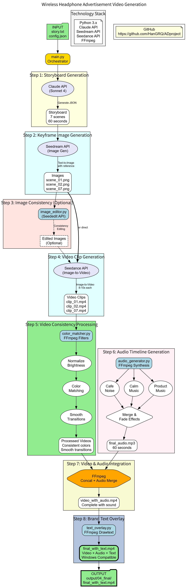

# AI-Powered Advertisement Video Generator

Automatically generate professional advertisement videos from text stories using AI.

## Final Output

**Generated Video:** `output/04_final/final_with_text.mp4`

---

## System Workflow



---

## Tools and Technologies

| Component | Technology | Purpose |
|-----------|-----------|---------|
| AI Orchestration | Claude API (Sonnet 4) | Generate storyboard from text story |
| Image Generation | BytePlus Seedream 4.0 | Create scene images (1920x1080) |
| Video Generation | BytePlus Seedance | Convert images to video clips |
| Video Processing | FFmpeg | Color matching, transitions, merging |
| Audio Generation | FFmpeg | Synthesize background music |
| Text Overlay | FFmpeg | Add brand name overlay |
| Orchestration | Python 3.8+ | Coordinate entire workflow |

---

## Processing Workflow

### Step 1: Storyboard Generation
**Input:** `story.txt`  
**Process:** Claude API converts text to structured JSON storyboard (7 scenes)  
**Output:** `output/01_storyboard/storyboard.json`  
**Time:** 3-5 minutes

### Step 2: Image Generation
**Input:** Storyboard JSON  
**Process:** Seedream API generates 7 keyframe images  
**Output:** `output/02_images/scene_01.png` to `scene_07.png`  
**Time:** 20-35 minutes

### Step 3: Image Editing (Optional)
**Status:** Currently skipped for faster processing  
**Purpose:** Fix consistency issues if needed

### Step 4: Video Generation
**Input:** 7 images  
**Process:** Seedance API converts each image to 8-10 second video clip  
**Output:** `output/03_video_clips/clip_01.mp4` to `clip_07.mp4`  
**Time:** 35-70 minutes

### Step 5: Color Matching
**Input:** 7 video clips  
**Process:** FFmpeg normalizes brightness, matches colors, adds fade transitions  
**Output:** `output/03_video_clips/temp_color_match/`  
**Time:** 5-10 minutes

### Step 6: Audio Generation
**Input:** Storyboard scene types  
**Process:** FFmpeg synthesizes cafe noise, calm music, product music  
**Output:** `output/audio/final_audio_faded.mp3`  
**Time:** 1-2 minutes

### Step 7: Video and Audio Merge
**Input:** Processed video clips + audio track  
**Process:** FFmpeg concatenates videos and synchronizes audio  
**Output:** `output/04_final/video_with_audio.mp4`  
**Time:** 2-5 minutes

### Step 8: Text Overlay
**Input:** Video with audio  
**Process:** FFmpeg adds brand name text with fade animation (last 5 seconds)  
**Output:** `output/04_final/final_with_text.mp4`  
**Time:** 1-2 minutes

**Total Processing Time:** 50-70 minutes

---

## Quick Start

### Prerequisites
- Python 3.8+
- FFmpeg installed
- API Keys: Claude API, BytePlus API

### Setup
```bash
# Create virtual environment
python -m venv venv
venv\Scripts\activate

# Install dependencies
pip install anthropic requests
```

### Run
```bash
python main.py
```

---

## Project Structure

```
headphone_ad_project/
├── main.py                    # Main orchestrator
├── audio_generator.py         # Audio synthesis
├── text_overlay.py           # Text overlay
├── color_matcher.py          # Color matching
├── image_editor.py           # Image editing
├── config.json               # Configuration
├── story.txt                 # Input story
├── workflow.png              # Workflow diagram
└── output/
    ├── 01_storyboard/        # Storyboard JSON
    ├── 02_images/            # Generated images
    ├── 03_video_clips/       # Video clips
    ├── 04_final/             # Final output
    │   └── final_with_text.mp4
    └── audio/                # Audio files
```

---

## Integrated Solution

This system integrates multiple AI services and tools into a single automated pipeline:

1. **Claude AI** generates the creative storyboard
2. **Seedream** creates consistent visual scenes
3. **Seedance** animates the scenes into video
4. **FFmpeg** processes and assembles the final video
5. **Python** orchestrates the entire workflow

All components work together seamlessly to transform text into a complete video with audio and branding.
